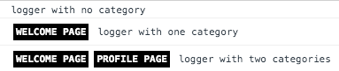
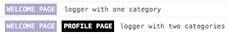

# 🚧 WIP project 🚧

# Purpose

logger-js is provides loggers for browser and terminal that can be customised and/or inherited to define your own logger.

The core functionnality is to log on user-defined categories, other than the "traditionals" log/debug/info/error.

You can configure your categories to be logged or not.
You can customise the way your category is displayed (formatting like font color, background, padding, margin)

# How to use it

## For browser code

### The simple way

```javascript
import { DefaultBrowserLogger } from '@jkhong/logger-js';

const logger = new DefaultBrowserLogger();
logger.getLogger()('logger with no category');

// simple but you don't have any benefits
```

### Some minimal configuration

```javascript
import { DefaultBrowserLogger } from '@jkhong/logger-js';

const logger = new DefaultBrowserLogger();
// define the logs categories you want to use
logger.setCategoriesSettings([
   {
      categoryName: 'Welcome Page',
   },
   {
      categoryName: 'Profile Page',
   },
]);

logger.getLogger(['Welcome Page'])('logger with one category');

// a logger which is linked to 2 catégories
// if one category is deactivated, the other is still displayed
logger.getLogger(['Welcome Page', 'Profile Page'])('logger with two categories');
```

#### Output in Chrome console



### Customize color, font, margin, etc...

```javascript
logger.setCategoriesSettings([
   {
      categoryName: 'Welcome Page',
      styles: {
         'background-color': '#AAACCC', // not black anymore
         'font-weight': 'normal', // not bold anymore
         margin: '0px 5px', //  more spaces before and after category name
      },
   },
   {
      categoryName: 'Profile Page',
   },
]);
```

#### Output in Chrome console


